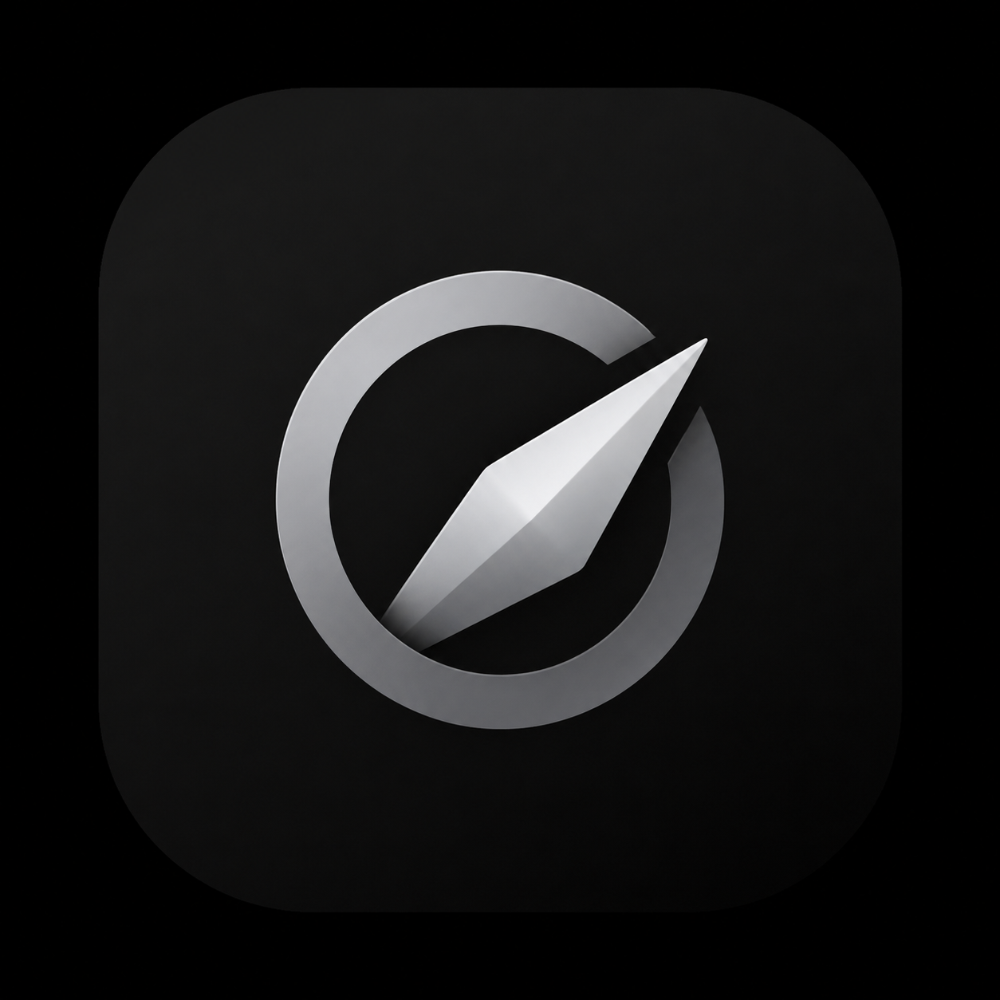

<p align="center">
  <picture>
    <source media="(prefers-color-scheme: dark)" srcset="assets/logo-dark.png">
    
  </picture>
</p>

<h1 align="center">Kernel Browser</h1>

<p align="center">
  <em>A polished GeckoView browser for Android, built without Chromium WebView.</em>
</p>

<p align="center">
  
  
  
  
</p>

<p align="center">
  <strong>Safari-inspired chrome &middot; address suggestions &middot; private tabs &middot; bundled extensions</strong><br>
  <sub>Kernel Browser is an Android browser shell around Mozilla GeckoView with native Kotlin UI, smooth settings sheets, square tab previews, history autofill, Google recommendations, and allowlisted WebExtension support.</sub>
</p>

---

> [!IMPORTANT]
> Kernel Browser is still an early Android browser project. Use the ABI-specific APK for your device; modern Samsung/Pixel phones should install the `arm64-v8a` APK from [v1.10](https://github.com/YashasVM/Kernel-browser/releases/tag/v1.10).

## What Is Kernel Browser?

Kernel Browser is a native Android browser built with Kotlin, XML views, and `GeckoView`. It keeps the UI lightweight and Android-first while using Mozilla's browser engine instead of Android `WebView`.

```text
Android UI -> BrowserTabs -> GeckoSession -> GeckoView
                 |
                 +-> History, settings, extensions, tab previews
```

---

## Features

| Feature | Details |
|---|---|
| **Native Android Shell** | Kotlin and XML views drive the app chrome without a web-based UI layer. |
| **GeckoView Engine** | Pages run through Mozilla GeckoView with one shared `GeckoRuntime`. |
| **Safari-Inspired Chrome** | Bottom controls auto-hide after a short delay and return when the page is tapped. |
| **Google Defaults** | Home, empty input, and non-URL searches use Google. |
| **Address Suggestions** | The address bar shows Google recommendations and previously visited pages while typing. |
| **Tab Management** | Normal/private tab modes, a clean square tab panel, and live page thumbnails. |
| **Private Tabs** | Private tabs are separated and closed when the app exits. |
| **History** | The settings sheet can show and clear browsing history. |
| **Extensions** | Allowlisted WebExtensions with permission summaries and private-tab toggles. |
| **Bundled Blocking** | uBlock Origin is enabled by default when extension assets are fetched. |

---

## Quick Start

### 1. Clone

```powershell
git clone https://github.com/YashasVM/Kernel-browser.git
cd Kernel-browser
```

### 2. Fetch Extension Assets

Extension binaries are generated assets and are ignored by Git. Fetch the pinned allowlist before testing extension behavior:

```powershell
.\scripts\fetch_extensions.ps1 -Clean
```

### 3. Build

Use Android Studio's bundled JBR for command-line builds:

```powershell
$env:JAVA_HOME='C:\Program Files\Android\Android Studio\jbr'
.\gradlew.bat testDebugUnitTest assembleRelease --no-daemon
```

Release APKs are written to:

```text
app/build/outputs/installable/
```

For phone installs, see [docs/install.md](docs/install.md).
For release verification, see [docs/build.md](docs/build.md).

---

## APKs

| APK | Use On |
|---|---|
| [`KernelBrowser-1.10-v1.10-safari-suggestions-2026-06-24-arm64-v8a.apk`](https://github.com/YashasVM/Kernel-browser/releases/tag/v1.10) | Modern phones, including Galaxy S24 Ultra |
| [`KernelBrowser-1.10-v1.10-safari-suggestions-2026-06-24-armeabi-v7a.apk`](https://github.com/YashasVM/Kernel-browser/releases/tag/v1.10) | Older 32-bit Android devices |
| [`KernelBrowser-1.10-v1.10-safari-suggestions-2026-06-24-x86_64.apk`](https://github.com/YashasVM/Kernel-browser/releases/tag/v1.10) | Android emulators and x86_64 devices |

> [!NOTE]
> GeckoView native libraries dominate APK size. ABI split APKs are the practical way to avoid shipping every native architecture to one phone.

---

## Repository Layout

```text
.
|-- app/
|   |-- src/main/java/com/kernel/browser/     # Kotlin browser shell
|   |-- src/main/res/                         # Native Android UI resources
|   `-- build.gradle.kts                      # Android app build
|-- assets/                                   # README and project visuals
|-- docs/                                     # Install and release notes
|-- scripts/fetch_extensions.ps1              # Fetch pinned extension assets
|-- build.gradle.kts
|-- settings.gradle.kts
`-- README.md
```

---

## Building

### Debug

```powershell
$env:JAVA_HOME='C:\Program Files\Android\Android Studio\jbr'
.\gradlew.bat testDebugUnitTest assembleDebug --no-daemon
```

### Release

```powershell
$env:JAVA_HOME='C:\Program Files\Android\Android Studio\jbr'
.\gradlew.bat testDebugUnitTest assembleRelease --no-daemon
```

### Install On A Connected Phone

```powershell
$adb="$env:LOCALAPPDATA\Android\Sdk\platform-tools\adb.exe"
& $adb install -r app\build\outputs\installable\KernelBrowser-1.10-v1.10-safari-suggestions-2026-06-24-arm64-v8a.apk
```

---

## Extension Assets

The fetch script downloads official AMO XPI artifacts, verifies SHA-256 checksums, unpacks them into `app/src/main/assets/extensions/`, validates Gecko extension IDs from `manifest.json`, and writes `app/src/main/assets/extensions.json`.

| Extension | Default |
|---|---|
| **uBlock Origin** | Enabled |
| **Cookie-Editor** | Disabled |

---

## Release Notes

Latest release notes are in [docs/releases/v1.10.md](docs/releases/v1.10.md).

---

## Roadmap

- Smooth out tab thumbnails across background tabs.
- Add a first-run onboarding screen for extension permissions.
- Add signed CI release builds for ABI split APKs.
- Keep refining settings, extensions, and tabs around the same Safari-like motion system.

---

## License

MIT. See [LICENSE](LICENSE).
